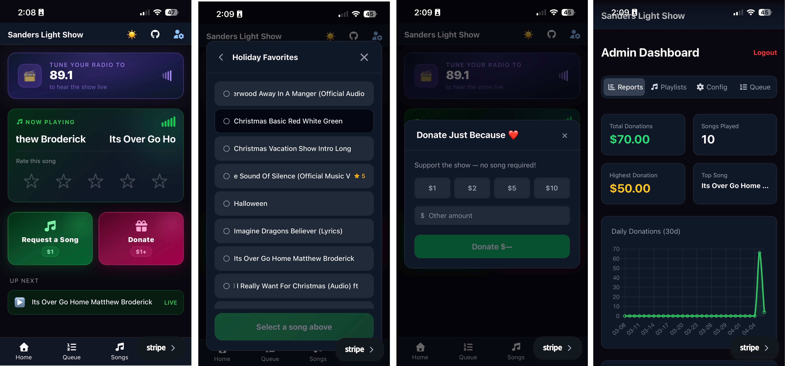

# QueueTheMagic

A real-time holiday light show song request and donation web app. Visitors pay via Stripe to queue songs played by [Falcon Player (FPP)](https://falconchristmas.com/). A default playlist runs between requests. Includes an admin dashboard with live queue management, reporting, and MQTT integration.

**Built by [Brad Sanders](https://github.com/thebradleysanders)**

## Goal
I often get asked 
 * 'how can I donate?'
 * 'how can I see the song list, when can I see it?'
 * 'I love x song from last year, can I see it again?'
   
 I have solved this with a simple self-hosted website users can access from social media or by simple scanning a QR code, for example a yard sign.

---

## Screenshots


## Features

- Song request queue with [Stripe](https://stripe.com/) payment ($1+ per request)
- Bump queue position with a donation
- "Just Because" donations (no song required)
- Live queue updates via SignalR WebSockets
- FPP integration, controls playback directly, import sequences, playlists & schedule.
- Weekly show schedule (hours of operation)
- Season on/off toggle with custom off-season message
- Song ratings with admin report
- Admin dashboard: config, reports, live queue, diagnostics
- MQTT event publishing (optional)
- Light/dark theme
- Mobile-first responsive design

---

## Docker Setup

### Prerequisites

- [Docker](https://docs.docker.com/get-docker/) and Docker Compose
- A [Stripe](https://stripe.com) account (test keys work fine for development)
- [Falcon Player](https://github.com/FalconChristmas/fpp) running on your network
- A reverse proxy like [Traefik](https://github.com/traefik/traefik) or [Nginx Proxy Manager](https://github.com/NginxProxyManager/nginx-proxy-manager), for HTTPS (Required for [Stripe](https://stripe.com))
    - Ensure websocket support is enabled. 

### 1. Create a docker-compose.yml

Create a new folder and add this file, no repo clone needed:

```yaml
services:
  app:
    image: thebradleysanders/queuethemagic:latest
    container_name: qtm
    ports:
      - "80:80"
    environment:
      - Stripe__SecretKey=sk_live_...
      - Stripe__PublishableKey=pk_live_...
      - AdminPassword=your-secure-password
      - Jwt__Secret=change-this-to-a-long-random-string-min-32-chars
      - AllowedOrigins=http://your-server-ip
    volumes:
      - qtm-data:/app/data
    restart: unless-stopped

volumes:
  qtm-data:
    name: qtm-data
```

### 2. Start the container

```bash
docker compose up -d
```

### 3. First-time setup

1. Open `http://your-server-ip` — the public site is live
2. Go to `http://your-server-ip/admin` and log in with your `AdminPassword`
3. In **Config → Falcon Player (FPP)**:
   - Verify the FPP Address matches your player
   - Click **Import Playlists & Songs** to sync your FPP library
   - Select your **Default Playlist** from the dropdown
4. Set your show schedule, site name, FM station, and pricing
5. Click **Save Configuration**

### Useful commands

```bash
# View logs
docker compose logs -f

# Stop
docker compose down

# Stop and delete all data
docker compose down -v

# Pull latest images and restart
docker compose pull && docker compose up -d
```

---

## Environment Variables

All configuration is passed via environment variables, no config files to edit.

| Variable | Default | Description |
|---|---|---|
| `Stripe__SecretKey` | — | Stripe secret key (server-side) |
| `Stripe__PublishableKey` | — | Stripe publishable key (returned to frontend via API) |
| `AdminPassword` | — | Password for `/admin` login |
| `Jwt__Secret` | — | Token signing secret, min 32 characters, keep private |
| `AllowedOrigins` | `https://localhost` | CORS origin — your domain or IP |

> FPP address and all other show settings are configured via the admin dashboard and stored in the database.

---

## Data Persistence

All data (songs, queue history, donations, ratings, configuration) is stored in a named Docker volume `qtm-data`. It survives container restarts and image updates.

**Backup:**
```bash
docker run --rm -v qtm-data:/data -v $(pwd):/backup alpine \
  tar czf /backup/qtm-backup.tar.gz -C /data .
```

**Restore:**
```bash
docker run --rm -v qtm-data:/data -v $(pwd):/backup alpine \
  tar xzf /backup/qtm-backup.tar.gz -C /data
```

---

## FPP Integration

QueueTheMagic communicates directly with your Falcon Player over HTTP. Make sure:

- FPP is reachable from the Docker host at the IP set in `FppAddress`
- FPP API is enabled (it is by default on all FPP installs)
- After adding or removing sequences in FPP, click **Import Playlists & Songs** in the admin config to re-sync

The app polls FPP every 5 seconds (configurable in admin). When a user song is queued, the poller wakes immediately and starts playback. When the song ends, the default playlist resumes automatically.

---

### Local development (without Docker)

**Backend:**
```bash
cd api
dotnet restore
dotnet run   # http://localhost:5288
```

**Frontend:**
```bash
cd web
npm install
npm run dev  # http://localhost:5173
```

Create `web/.env.local`:
```env
VITE_API_BASE_URL=http://localhost:5288
```

---

## Stack

- **Backend**: ASP.NET Core 9, SQLite, Entity Framework Core, SignalR, Stripe.net, MQTTnet
- **Frontend**: Vue 3, Pinia, PrimeVue, Tailwind CSS v4, Vite
- **Infrastructure**: Docker, nginx, SQLite

---

## License

MIT
